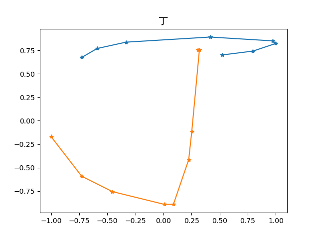
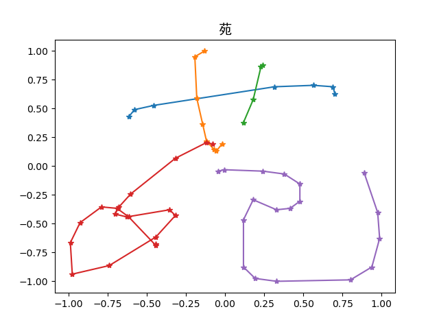

Here is an illustration of how transformed Chinese character looks like. We store each character in the form \[x,y,n\] 
where x,y are coordinates restricted in \[0,1\], n represents the number of the stroke this point belongs to.

 

